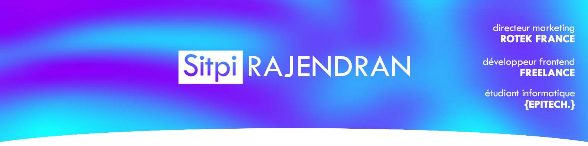

### __Hey you__ 👋

Je suis Sitpi RAJENDRAN, un étudiant en informatique basé à Paris et sur le World Wide Web.

***	

### Mes réseaux sociaux 👋

<table style="border: 0;">
 <tr>
    <td>
    
    </td>
        <td>
    
    </td>
        <td>
    
    </td>
 </tr>
</table>

***	
<table style="border: 0;width: 100%;">
    <tr>
        <td>
        <h3 align="left"><b>Mes derniers projets 😎</b></h3>
        <ul>
        <li><a href="https://github.com/SitpiRajendran/Ou-est-Chen">Où est Chen</a> : Mini Escape Game - Organisé pour et avec l'aide du BDE Ravens </li>
        <li><a href="https://github.com/SitpiRajendran/TheFrenchWikiGame">TheFrenchWikiGame</a> : Le jeu du wikipédia en version française</li>
        <li><a href="https://github.com/SitpiRajendran/Personal-VTC">My Personal VTC</a> : Application en Flutter, pour envoyer ma localisation par SMS.</li>
        <li><a href="https://github.com/SitpiRajendran/discord-mandalorian">C3P0 - The Mandalorian</a> : Bot Discord avec une gestion de temps, de niveau, de réaction et d'audio</li>
        </ul>
        </td>
        <td>
        <h3 align="left"><b>Mes projets {EPITECH.} 🏫</b></h3>
                <ul>
        <li><a href="https://github.com/SitpiRajendran/epitech-semester1">Semestre 1</a> : Première partie de la Tek1 incluant la fameuse Piscine</li>
        <li><a href="https://github.com/SitpiRajendran/epitech-semester2">Semestre 2</a> : Seconde partie de la Tek1 </li>
        <li>Semestre 3 : stage en entreprise </li>
        <li><a href="https://github.com/SitpiRajendran/epitech-semester4">Semestre 4</a> : Tek2 </li>
        <li><a href="https://github.com/SitpiRajendran/epitech-semester5">Semestre 5</a> : Tek3</li>
        </ul>
        </td>
    </tr>
</table>

<h3 align="left"><b>Languages and Tools:</b></h3>

                  

<!--
**SitpiRajendran/SitpiRajendran** is a ✨ _special_ ✨ repository because its `README.md` (this file) appears on your GitHub profile.

Here are some ideas to get you started:

- 🔭 I’m currently working on ...
- 🌱 I’m currently learning ...
- 👯 I’m looking to collaborate on ...
- 🤔 I’m looking for help with ...
- 💬 Ask me about ...
- 📫 How to reach me: ...
- 😄 Pronouns: ...
- ⚡ Fun fact: ...
-->
